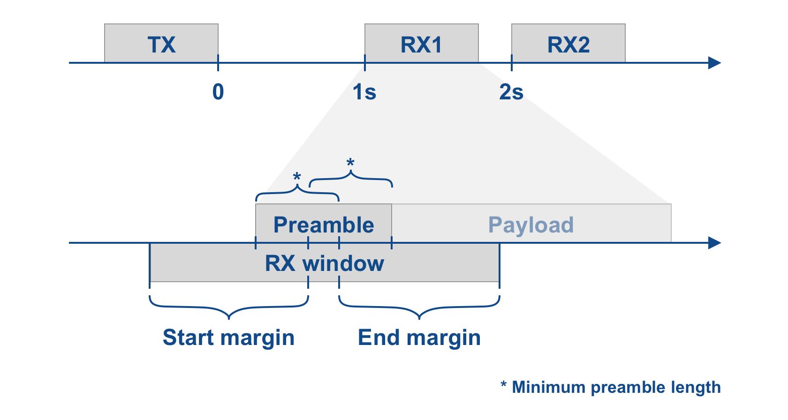

# SX127x Probe – STM32F1x software to monitor the LoRa timings of a Semtech SX127x chip

Software to monitor the communictaion with a Semtech SX127x chip to verify the firmware such a LMIC achieves correct LoRa timings. The software is run on a STM32F1x board (e.g. Blue Pill or Black Pill) and connected to  several pins of the LoRa board. It monitors the SPI communication and the interrupt pins, measures the timing and analyzes whether they conform to the LoRa standard.

## Connections

### Connections between probe (STM32 board) and SX127x board

| SX127x     | Probe     |
| ---------- | --------- |
| GND        | GND       |
| NSS / CS   | PB12      |
| SCLK       | PB13      |
| MOSI       | PB15      |
| DIO0       | PB3       |
| DIO1       | PB4       |

With the exception of GND, all connections are configured as inputs with no pull up/down and they are assigned to 5V tolerant pins.
So they can be connected in addition to the already existing circuitry between the SX127x chip and the MCU.
They do not affect the SX127x/LoRa board, and they work both 3.3V and 5V boards.

### Outputs

The result is writting to the serial output, using 115,200 bps:

- PA2: TX

Additionally, a 1 kHz square wave is output so you can measure the accurracy of the probe clock.

- PA1: 1 kHz reference clock

## Analysis

The probe listens to the SPI communication between the MCU and the SX127x chip and tracks the settings such a spreading factor and bandwidth. Additionally, it listens for the *opmode* command that puts the transceiver into transmit or receive mode.

The time of the CS signal returing to *high* after the *opmode* command is recorded (see figure below). In addition, the time of the *done* and *timeout* interrupts are recorded.

For the further analysis, it is then assumed that the interrupts occur immediately after transmission (air time), receiption (air time) or timeout expiration. The remaining duration is assumed to be preceding ramp-up time, e.g. to lock the PLL to the desired frequency.

Based on this data, the timing of the RX window is examined. The window should be scheduled such that the preamble that precedes the payload falls within the window. If a preamble is detected, the receiver receives the payload. Otherwise, it will stop when the timeout expires.

The typical payload length is 8 symbols. 5 symbols are usually sufficient to reliably detect the preamble (called *minimum preamble length* in below figure). Therefore it is sufficient if somewhat more than half of the preamble fall into the window.

The probe calculates the timing margin, separately for the start and the end of the RX window. The margin must be greater than 0 and optimally the start and end margin about the same length. A start and end margin of 5ms means that the timing for the RX windows could be off by 5ms in either direction and a downlink message would still be successfully received.

The probe prints the start and end margin for each RX window and propose a correction factor to properly center the RX window and the expected preamble.

There are two reason why they are not properly centered:

1. The timing calculation might be flawed.

2. The delay caused by the code run on the MCU, the SPI communication to change the *opmode* and the ramp-up of the transceiver might not have been fully accounted for. The delay is dependent of the type of MCU, the MCU's clock speed and the SPI speed.

## Project

The software project uses the STM32Cube HAL library and [PlatformIO](https://platformio.org/).

## Architecture

The software is divided into several parts:

- Data recording uses interrupts and DMA and mainly runs in interrupt handlers.
- Data analysis and output runs as the main code (main loop).
- UART output is fully asynchronous and mainly runs in interrupt handlers.

The recorded data is written to a queue, read by the data analysis code.

### SPI Recording

The device is configured as an SPI slave that receives only (no transmissions). It listens on the master-to-slave communication. It does not listen to the slave-to-master communication.

The SPI peripheral is configured with DMA, a circular buffer and hardware NSS. The NSS input is additionally configured with an external interrupt. Each time the raising edge triggers it, the time and the position within the circular buffer is recorded and written to the main queue.

### DIO0 and DIO1 pins

The DIO0 and DIO1 pins are configured with an external interrupt. On each raising edge, the time is recorded and written to the main queue.

### Analysis

The analysis code waits for new entries in the main queue and processes them. SPI transactions are analyzed. If they are a commmand to put the transceiver in TX or RX_SINGLE mode, the event is output. DIO0 and DIO1 triggers are also output.

### Output

Output is written asynchronously. The text is first put in a fixed, circular buffer. Additionally, a queue entry is created in the UART queue for the appended text chunk. Each time a chunk is added or a chunk transmission is completed, the queue is checked. If it contains further chunks, the transmission of the next chunk is started. The transmissions uses the UART in DMA mode.
